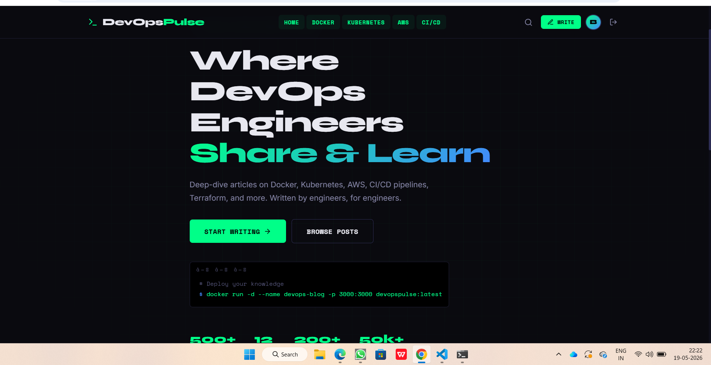
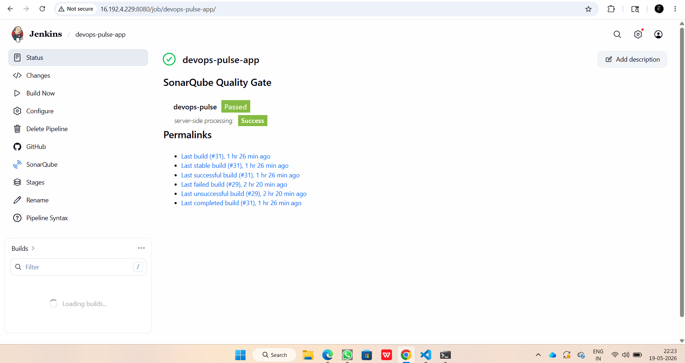
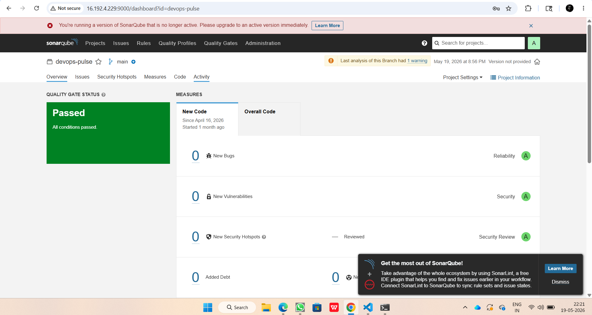
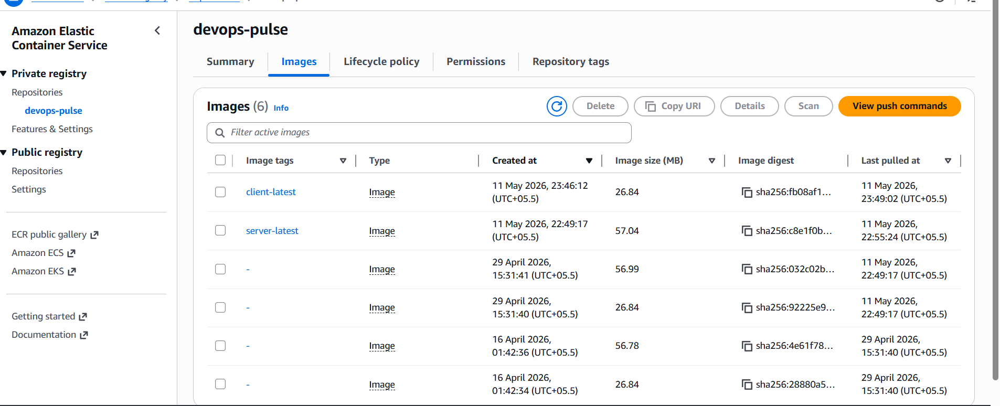

# 🚀 DevOps Pulse

A production-ready MERN Stack blogging platform built using DevOps and DevSecOps best practices. The application is containerized with Docker, deployed on AWS ECS, and automated using Jenkins CI/CD pipelines with integrated security and quality checks.

---

## 📖 Project Overview

DevOps Pulse is a full-stack blogging platform where developers can share technical articles related to:

- Docker
- Kubernetes
- AWS
- CI/CD
- Terraform
- DevOps

This project demonstrates real-world DevOps implementation using AWS cloud services, Infrastructure as Code, containerization, CI/CD automation, and security scanning.

---

## ✨ Features

- 🔐 User Authentication (JWT)
- 📝 Create, Edit & Delete Blogs
- 📚 Browse DevOps Articles
- 👤 User Profile Management
- 📱 Responsive UI
- 🐳 Dockerized Frontend & Backend
- ☁️ AWS ECS Deployment
- 🚀 Automated CI/CD Pipeline
- 🔍 SonarQube Code Quality Analysis
- 🛡️ Trivy Container Vulnerability Scanning
- 📊 CloudWatch Monitoring
- 📦 Amazon ECR Image Repository

---

# 🏗️ Architecture

```
Developer
      │
      ▼
 GitHub Repository
      │
      ▼
 Jenkins Pipeline
      │
 ┌───────────────┐
 │ SonarQube     │
 │ Quality Scan  │
 └───────────────┘
      │
      ▼
 Docker Build
      │
      ▼
 Trivy Security Scan
      │
      ▼
 Push Image to Amazon ECR
      │
      ▼
 Amazon ECS Cluster
      │
      ▼
 Application Load Balancer
      │
      ▼
 DevOps Pulse Application
```

---

# ⚙️ Tech Stack

## Frontend

- React.js
- HTML5
- CSS3
- JavaScript

## Backend

- Node.js
- Express.js

## Database

- MongoDB

## DevOps

- Docker
- Jenkins
- GitHub
- GitLab
- Terraform
- SonarQube
- Trivy
- Checkov

## AWS Services

- Amazon ECS
- Amazon ECR
- Amazon EC2
- Application Load Balancer
- IAM
- VPC
- CloudWatch
- Auto Scaling

---

# 📂 Project Structure

```
devops-pulse/
│
├── client/
│
├── server/
│
├── docker-compose.yml
│
├── package.json
│
└── .gitignore
```

---

# 🚀 CI/CD Pipeline

The Jenkins pipeline performs the following stages:

1. Clone Repository
2. Install Dependencies
3. Build Application
4. SonarQube Code Analysis
5. Quality Gate Validation
6. Build Docker Images
7. Trivy Security Scan
8. Push Images to Amazon ECR
9. Deploy to AWS ECS
10. Verify Deployment

---

# 🔐 DevSecOps

This project integrates multiple security tools:

- SonarQube
- Trivy
- Checkov
- OWASP Best Practices

---

# ☁️ AWS Infrastructure

Infrastructure is provisioned using Terraform.

Resources include:

- VPC
- Public Subnets
- Private Subnets
- Internet Gateway
- NAT Gateway
- Route Tables
- Security Groups
- IAM Roles
- ECS Cluster
- ECS Service
- Application Load Balancer
- CloudWatch

---

# 📊 Monitoring

- Amazon CloudWatch
- ECS Logs
- Jenkins Build Logs
- SonarQube Reports

---

# 🐳 Docker

Build images

```bash
docker-compose build
```

Run containers

```bash
docker-compose up -d
```

Stop containers

```bash
docker-compose down
```

---

# 📸 Project Screenshots

## Application



---

## Jenkins Pipeline


---

## SonarQube Report



---

## Amazon ECR Repository



---

# 💻 Local Setup

Clone repository

```bash
git clone https://github.com/Bhagyashil-git/devops-pulse.git
```

Go into project

```bash
cd devops-pulse
```

Install dependencies

```bash
npm install
```

Start backend

```bash
cd server
npm start
```

Start frontend

```bash
cd client
npm start
```

---

# 👨‍💻 Author

**Bhagyashil Bhendare**

DevOps Engineer

📍 Nagpur, India

LinkedIn:
https://linkedin.com/in/bhagyashil-bhendare

GitHub:
https://github.com/Bhagyashil-git

---

# ⭐ If you like this project

Please consider giving it a ⭐ on GitHub.
